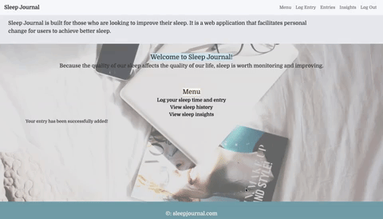
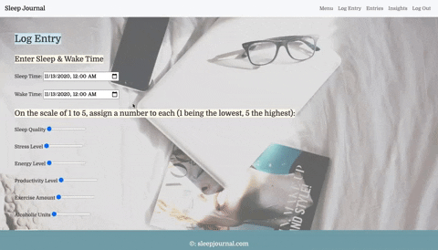
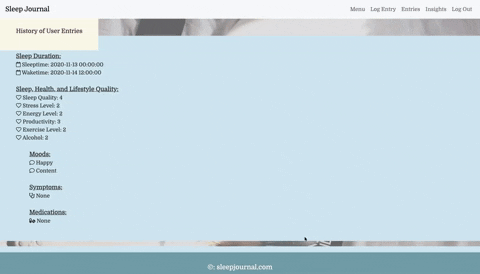

# 🌙 Sleep Journal ☁️

Sleep Journal is a sleep tracking full-stack web application that allows the user to input sleep time and duration, 
sleep quality, responses to other lifestyle fields, and view past entries. Sleep Journal facilitates personal change to 
achieve better sleep and is built for anyone who is looking to improve his or her sleep. <br>

## Contents
* [Features](#features)
* [Technologies & Stack](#techstack)
* [Set-up & Installation](#installation)
* [About the Developer](#aboutme)

View my **[YouTube demo](https://youtu.be/bu7xYZu7SIs)**!<br>

## <a name="features"></a> Features 🌙 

User registration, log-in, and log-out
<br>
<br>

<br>

User-friendly menu page
<br>
<br>

<br>

Log a daily entry on your sleep and related health and lifestyle fields
<br>
<br>

<br/>

View sleep entries
<br>
<br>

<br/>

## <a name="techstack"></a> Technologies and Stack 🌙
**Backend:**
Python, Flask, PostgreSQL, SQLAlchemy, Flask-SQLAlchemy <br>
**Templating:**
Jinja <br>
**Frontend:**
Javascript, jQuery, Bootstrap, HTML5, CSS3, Google Fonts, Font Awesome <br>


## <a name="installation"></a> Set-up & Installation 🌙
Install a code editor such as [VS code](https://code.visualstudio.com/download)<br>
Install [Python3](https://www.python.org/downloads/mac-osx/)<br>
Install [pip](https://pip.pypa.io/en/stable/installing/), the package installer for Python<br>
Install [postgreSQL](https://www.postgresql.org/) for the relational database<br>


Clone or fork repository:
```
$ git clone https://github.com/alice-yt/hackbright-project
```
Create and activate a virtual environment inside the directory:
```
$ virtualenv env
$ source env/bin/activate
```
Install dependencies:
```
$ pip3 install -r requirements.txt
```
With PostgreSQL, create the sleepjournal database:
```
$ createdb sleepjournal
```
Create all tables and relations in the database and seed all data:
```
$ python3 seed_database.py
```
Run the app from the command line:
```
$ python3 server.py
```

## <a name="aboutme"></a> ☁️ About the Developer

Sleep Journal creator, Alice Tang, graduated from Wellesley College with a double major in Economics and English. 
Previously, she worked as a marketing/advertising analyst. She developed an interest in software engineering when she 
worked closely with software engineers and saw how they were able to solve consumer and business problems with 
programming. She is most passionate about products that fulfill a user need, the intersection between human behavior 
and technology, and elegant design. This is her first full-stack project. 

She can be found on [LinkedIn](https://www.linkedin.com/in/tangalice/) and on [Github](https://github.com/alice-yt).